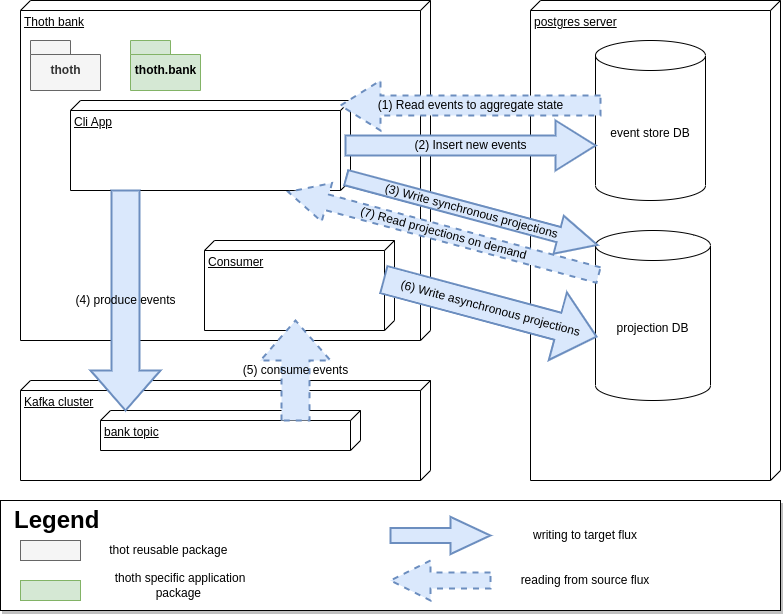

# thoth bank
Welcome to this proof of concept banking application using [MAIF thoth library](https://github.com/MAIF/thoth).
This is a Spring project initialized with [Spring initializr](https://start.spring.io/) 3.0.0 using maven.

# Table of Contents
1. [Installation](##Installation)
2. [Java Spring runtime services](##Java Spring runtime services)
3. [CliApplication user guide](##CliApplication user guide)
4. [Testing](##Testing)

## Installation

### System requirements

- Java 17+
- docker and docker-compose for running Postgre & Kafka services. 
NB: you can of course also use local or remote Postgre/kafka services of your liking. 
Juste beware that projections logic heavily relies on the postgre [INSERT ... ON CONFLICT (UPSERT) syntax](https://www.postgresql.org/docs/11/sql-insert.html) that 
requires **Postgre >= 11.x**.

### Launching postgre and kafka

Here is a runtime flux overview :

postgres server and kafka cluster can be launched with docker using the `docker-compose.yml.dist` at the root of the project.
Copy it into a new `docker-compose.yml` file, update parameters to your linking, and launch it with `docker-compose up -d`.

Use `docker ps` to ensure the four needed containers are running. 
At first start it is probable that kafka container crashes since zookeeper is not yet ready. Just wait a few seconds and restart it with `docker start thoth_bank_kafka-1`.

### Configuring the java spring project

- In `src/main/resources` copy the `app-config.properties.dist` file into a new `app-config.properties` file.
  This is where you will define your custom configuration.
- Choose a location of your liking for a log directory (for example `project root/logs`) and update parameter `logging.file.path` accordingly.
- Update eventStore and projection DB connection parameters according to your dev environment.

### Importing dependencies with maven

TODO

## Java Spring runtime services

This projects contains 4 entrypoint classes. 

The array below list them all : all paths are exprimed from `src/main/java/com/bts/thoth/bank`. All configuration also have a specific package.

| Class               |                                                                      Description |      package       |             path              |
|---------------------|---------------------------------------------------------------------------------:|:------------------:|:-----------------------------:|
| DemoApplication     |                                      run a static test scenario on a new account | com.bts.thoth.bank |     DemoApplication.class     |
| CliApplication      |             CLI interactive application allowing to control and consult accounts | com.bts.thoth.bank |   BankCliApplication.class    |
| ConsumerApplication |                             Kafka consumer that updates asynchronous projections | com.bts.thoth.bank | BankConsumerApplication.class |
| DropperApplication  | Utility app to drop all event store and projection tables as well as kafka topic | com.bts.thoth.bank |   DropperApplication.class    |

#### Launching via CLI

TODO

## CliApplication user guide

Upon launching the main menu will be displayed on console : 
 
> Type a number to select an action :
> 
> 1 - create new account
> 
> 2 - set account for action / consultation
> 
> 3 - get one account information
> 
> 4 - get one account history
>
> 5 - find last opened accounts
>
> 6 - find first opened accounts
> 
> 7 - find last closed accounts
> 
> 8 - find first closed accounts
> 
> 9 - exit app
> 
> Type a choice and enter to validate:

Upon entering a valid number user enter an action process.

#### Create new account

It will ask the currency amount for the initial deposit : 
> Enter initial deposit amount : 

Upon enter it will trigger account creation display a validation message 
and enter the newly created account menu.

#### set account for action / consultation

It will ask the ID of the account to enter : 
> Enter accountId : 

Upon enter it will enter the requested account menu.

#### exit app

Terminate the application. 

### account menu

The account menu allows for depositing, withdrawing, closing 
as well as consulting one account state and history.

> (Account 123456789 selected)
> 
> Type a number to select an action :
> 
> 1 - deposit
> 
> 2 - withdraw
> 
> 3 - get current state
> 
> 4 - get history
> 
> 5 - close account
> 
> 6 - exit account
> 
>7 - exit app

## Testing